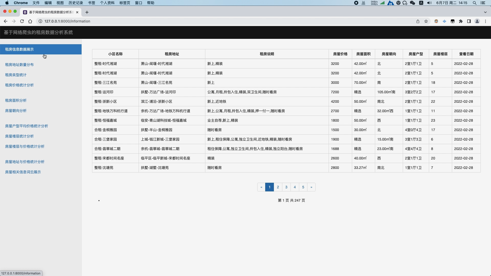
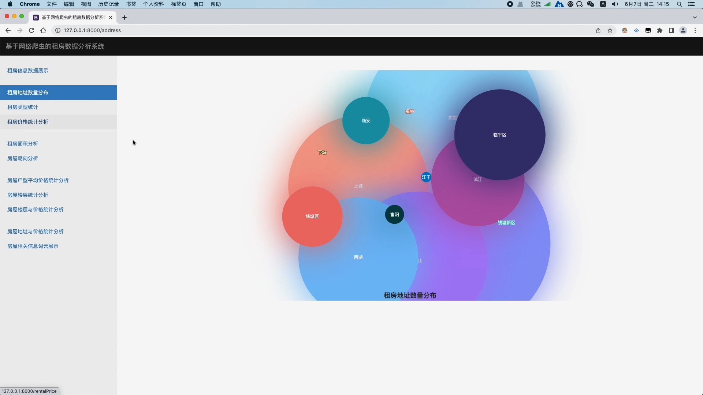
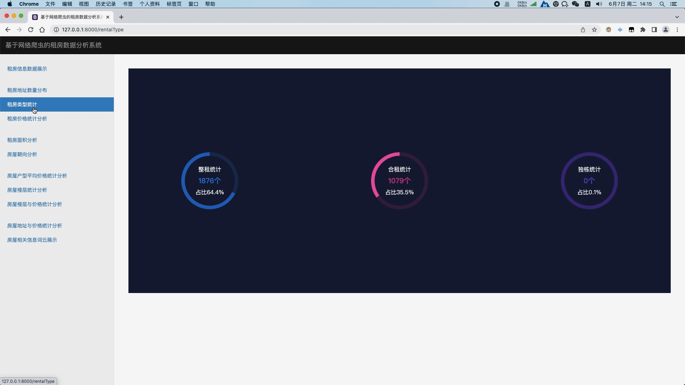
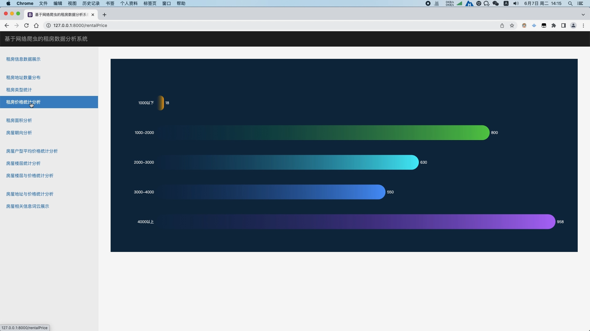
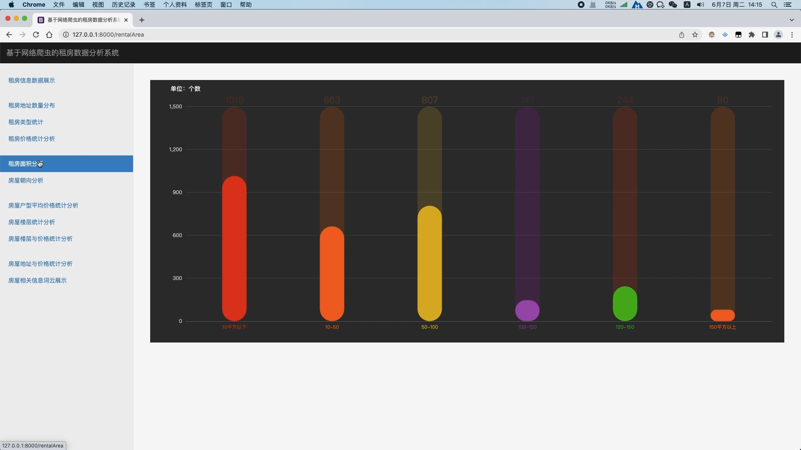
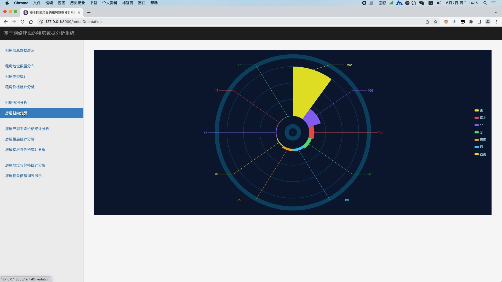
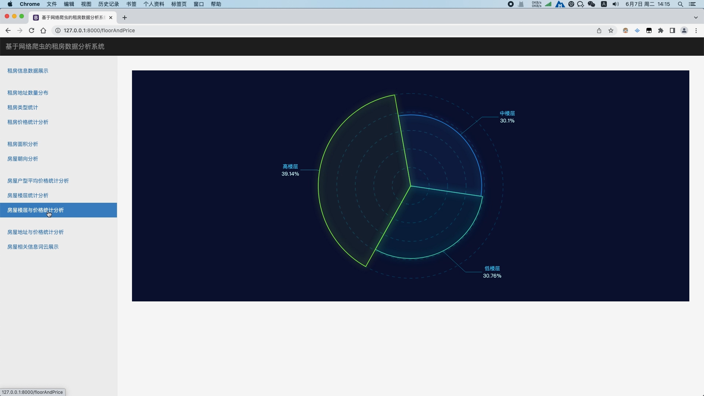
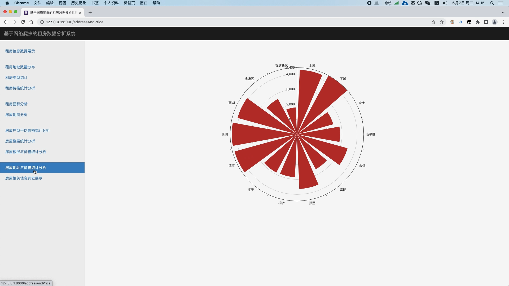

## 计算机毕业设计django+hadoop+scrapy租房可视化 租房推荐系统 租房大屏可视化 租房爬虫  spark 58同城租房爬虫 房源推荐系统

## 要求
### 源码有偿！一套(论文 PPT 源码+sql脚本+教程)

### 
### 加好友前帮忙start一下，并备注github有偿纯python租房可视化
### 我的QQ号是2827724252或者798059319或者 1679232425或者微信:bysj2023nb 或bysj1688

# 

### 加qq好友说明（被部分 网友整得心力交瘁）：
    1.加好友务必按照格式备注
    2.避免浪费各自的时间！
    3.当“客服”不容易，repo 主是体面人，不爆粗，性格好，文明人。
	
	
python scrapy bootstrap jquery css javascript html
租房信息数据展示 租房地址数量分布 租房类型统计 租房价格统计分析 租房面积分析 房屋朝向分析
房屋户型平均价格统计分析 房屋楼层统计分析 房屋楼层与价格统计分析 房屋地址与价格统计分析 房屋相关信息词云展示

演示视频
https://www.bilibili.com/video/BV1mS411c79r/?spm_id_from=333.999.0.0

